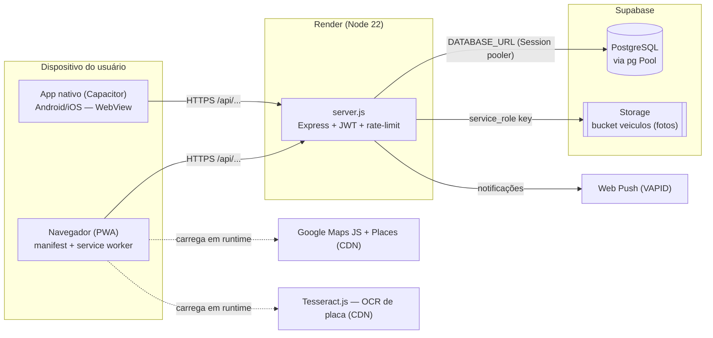
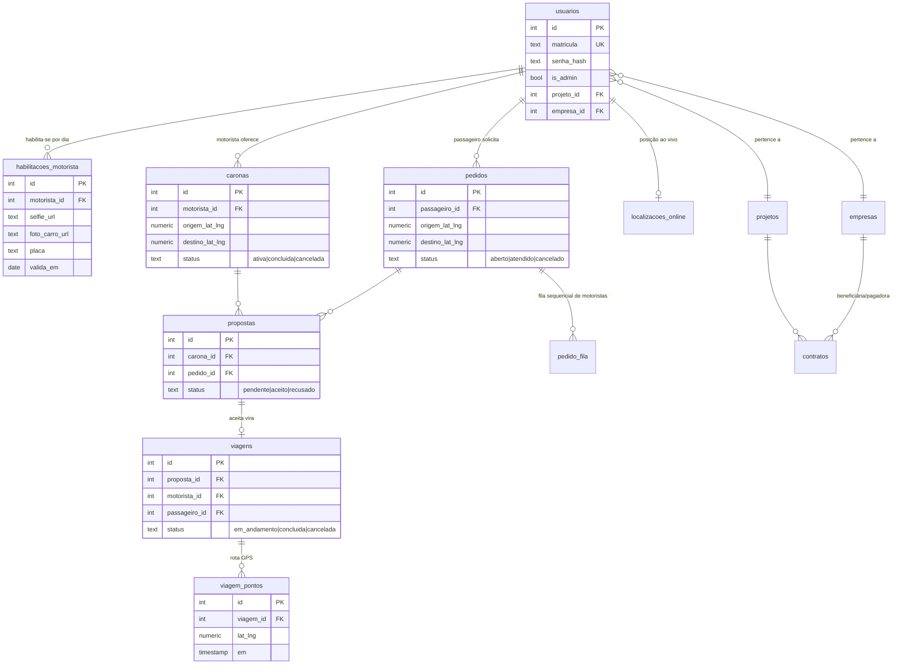
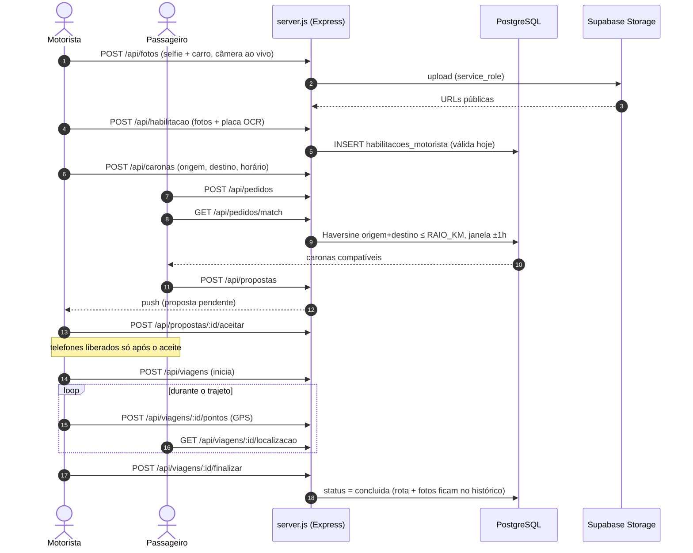
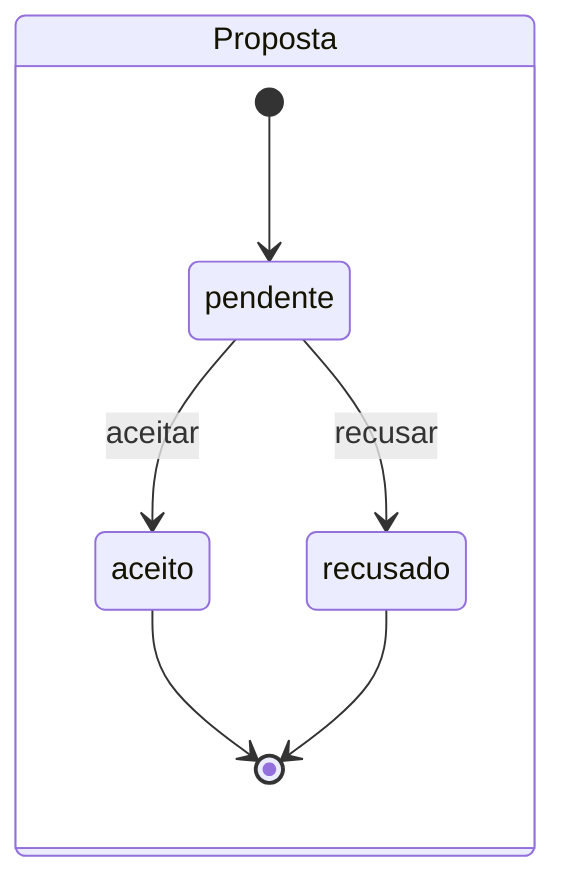
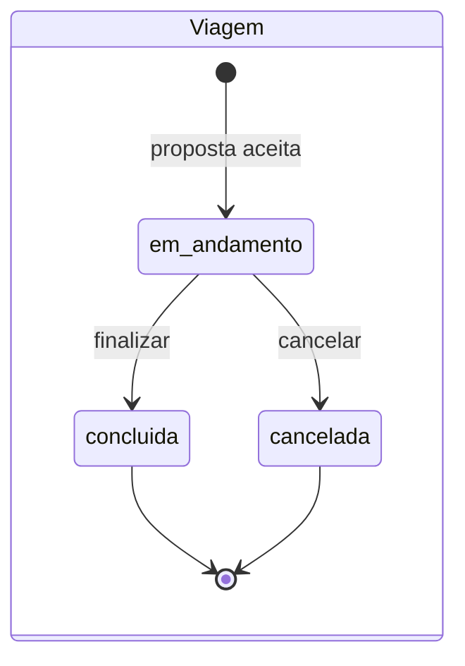
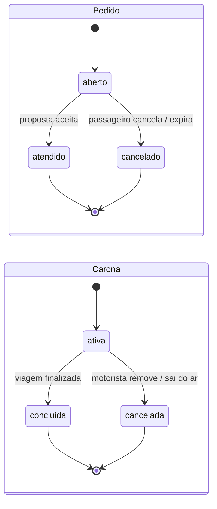

# VAP — Diagramas UML

Diagramas da arquitetura em [Mermaid](https://mermaid.js.org) (o GitHub renderiza
automaticamente). Fonte da verdade: `schema.sql` (dados), `server.js` (rotas) e
`docs/ARQUITETURA.md` (visão geral). Atualize este arquivo quando o fluxo principal
ou o schema mudarem.

## 1. Implantação (deployment)

O app das lojas é um **shell Capacitor**: a WebView carrega
`https://leopardo-api.onrender.com` (ver `capacitor.config.ts`), então front e API
ficam no mesmo domínio e o código web roda sem alterações.

## 2. Entidades principais (ER)

Tabelas de apoio fora do diagrama: `matriculas_bloqueadas`, `tokens_recuperacao`,
`push_subscriptions`, `usuarios_favoritos`, `contatos_motorista`, `admin_chamados`.

## 3. Sequência — fluxo completo de uma carona

## 4. Estados

Os valores de status são impostos por `CHECK` no `schema.sql` — novos códigos devem
usar exatamente esses literais.
